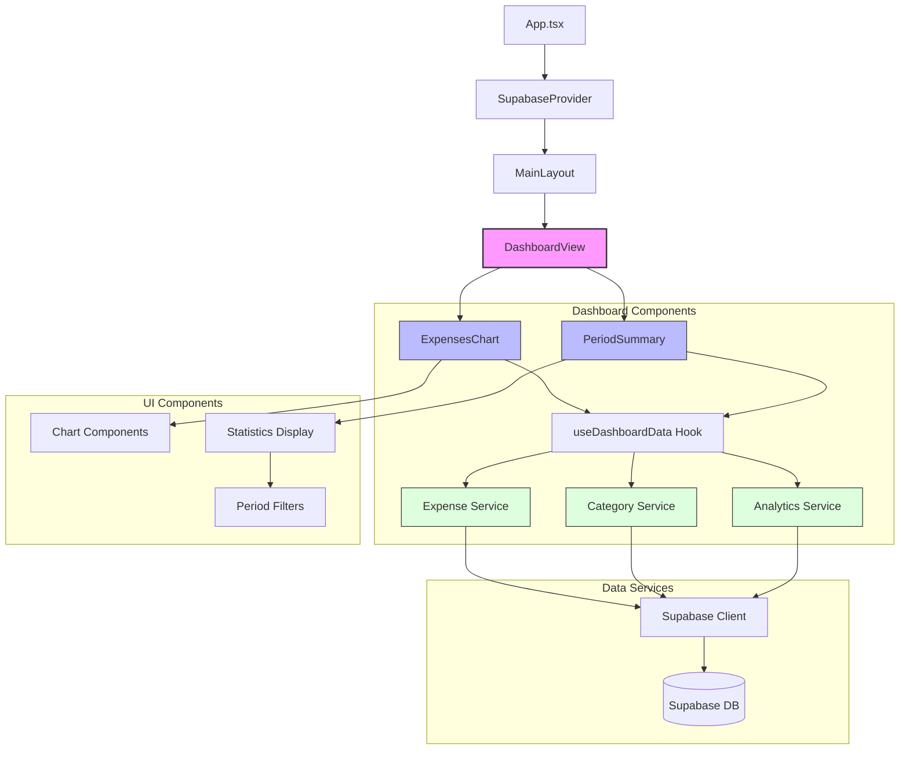

# Diagram struktury UI - MonityApp

## Opis komponentów

### Główne komponenty

- **App.tsx** - Główny komponent aplikacji
- **SupabaseProvider** - Provider kontekstu Supabase
- **MainLayout** - Główny układ aplikacji

### Widoki

- **DashboardView** - Główny widok dashboardu

### Komponenty dashboardu

- **ExpensesChart** - Wykres wydatków
- **PeriodSummary** - Podsumowanie dla wybranego okresu

### Usługi danych

- **Expense Service** - Zarządzanie wydatkami
- **Category Service** - Zarządzanie kategoriami
- **Analytics Service** - Analityka i statystyki

### Komponenty UI

- **Chart Components** - Komponenty wykresów
- **Statistics Display** - Wyświetlanie statystyk
- **Period Filters** - Filtry okresów
